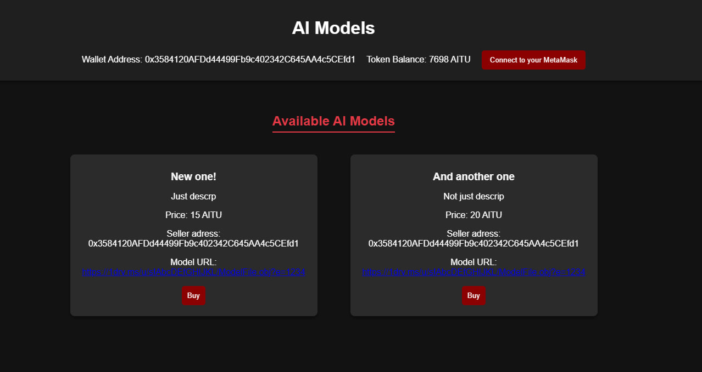
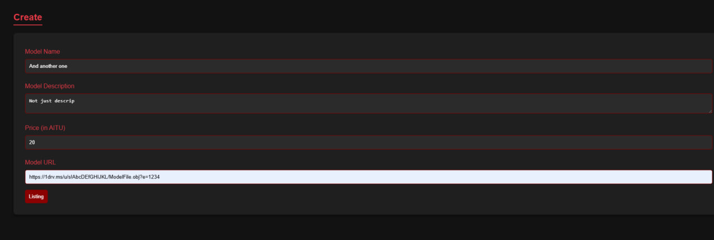
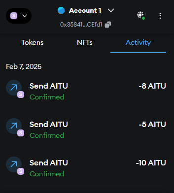
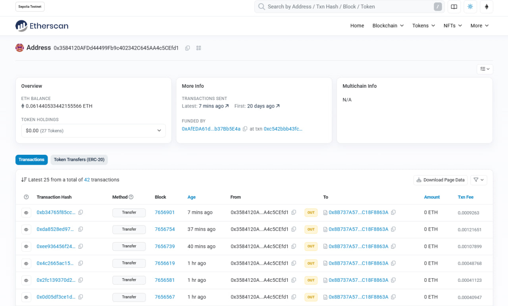
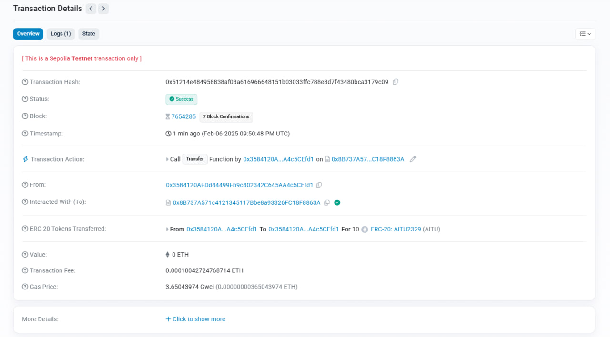

## AI Model Marketplace 
A decentralized marketplace for AI models built on Ethereum using smart contracts. Users can list, purchase, rate AI models, and creators can withdraw earnings. Powered by Truffle for smart contract development and Web3.js for Ethereum interaction.

## Features
List AI Models: Add AI models with a name, description, and price.
Purchase Models: Securely buy models with AITU Tokens.
View Model Details: Explore name, description, price.

## Key Features

- **ERC-20 Compliance:** Implements standard token functions such as `transfer`, `balanceOf`, and `approve`.
- **Initial Token Supply:** Mints 7700 tokens to the deployer's address upon contract deployment.
- **Advanced Transaction Tracking:**
  - Access block timestamps in a readable format for the latest transactions.
  - Retrieve sender and receiver addresses for specific transactions.

## Prerequisites

Ensure the following dependencies are installed before starting:

- [Node.js](https://nodejs.org/) v16 or higher
- [Hardhat](https://hardhat.org/)
- [MetaMask](https://metamask.io/)
- [Sepolia testnet ETH](https://cloud.google.com/application/web3/faucet/ethereum/sepolia/)
- [QuickNode](https://www.quicknode.com/)

## Installation

Setup
1. Clone the repository
2. Install dependencies
- Navigate to the project directory and run the following command to install the required packages:
```
npm install
```
3. Set up the Smart Contract
- Deploy the smart contract to the Ethereum network (use a test network like Sepolia for testing).
4. Start server
- Run the server to handle model uploads and serve API requests:
```
node server.js
```
- This will start the server on http://localhost:3000.

### `scripts/deploy.js`
The deployment script utilizes Hardhat to deploy the contract on the Sepolia testnet.
- Loads environment variables from `.env`
- Uses `hre.ethers.getSigners()` to retrieve deployer details
- Deploys `AITU2329` contract
- Outputs contract address upon successful deployment

## License
This project is licensed under the MIT License. See the [LICENSE](LICENCE) file for details.

## Examples





